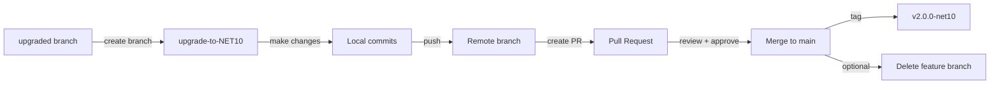

# ContosoUniversity .NET Framework 4.8 to .NET 10.0 Migration Plan

## Table of Contents

1. [Executive Summary](#executive-summary)
2. [Migration Strategy](#migration-strategy)
3. [Detailed Dependency Analysis](#detailed-dependency-analysis)
4. [Project-by-Project Plans](#project-by-project-plans)
   - [ContosoUniversity.csproj](#contosouniversitycsproj)
5. [Package Update Reference](#package-update-reference)
6. [Breaking Changes Catalog](#breaking-changes-catalog)
7. [Risk Management](#risk-management)
8. [Testing & Validation Strategy](#testing--validation-strategy)
9. [Complexity & Effort Assessment](#complexity--effort-assessment)
10. [Source Control Strategy](#source-control-strategy)
11. [Success Criteria](#success-criteria)

---

## Executive Summary

### Scenario Description

This plan outlines the migration of the ContosoUniversity ASP.NET MVC application from **.NET Framework 4.8** to **.NET 10.0 (Long Term Support)**. This is a **comprehensive architectural migration** from legacy ASP.NET Framework to modern ASP.NET Core.

### Scope

**Projects Affected:** 1 project
- ContosoUniversity.csproj (ASP.NET MVC Web Application)

**Current State:**
- Target Framework: net48 (.NET Framework 4.8)
- Project Type: Classic WAP (Web Application Project)
- SDK Style: Non-SDK style (legacy .csproj format)
- Lines of Code: 3,392
- Code Files: 56 files (23 with compatibility issues)

**Target State:**
- Target Framework: net10.0 (.NET 10.0)
- Project Type: ASP.NET Core Web Application
- SDK Style: Modern SDK-style project
- Architecture: ASP.NET Core MVC

### Discovered Metrics

| Metric | Value | Impact |
|--------|-------|--------|
| Total Projects | 1 | Single project migration |
| Package Issues | 39 | 26 packages need upgrade, 2 incompatible, 1 with security vulnerability |
| API Compatibility Issues | 571 | 534 binary incompatible, 37 source incompatible |
| Estimated LOC to Modify | 571+ | At least 16.8% of codebase requires changes |
| Security Vulnerabilities | 1 | Microsoft.Data.SqlClient 2.1.4 ? 6.1.3 |
| Deprecated Packages | 1 | Microsoft.Identity.Client 4.21.1 |

### Complexity Classification

**Classification: Critical** ??

**Justification:**
- **Architectural Migration Required**: This is not a simple framework upgrade�it's a complete architectural transformation from ASP.NET Framework (System.Web) to ASP.NET Core
- **High API Incompatibility**: 534 binary incompatible APIs (86.7% are System.Web.Mvc APIs that don't exist in ASP.NET Core)
- **Security Vulnerability Present**: Microsoft.Data.SqlClient has known security issues requiring immediate attention
- **Multiple Technology Migrations**:
  - ASP.NET Framework MVC ? ASP.NET Core MVC (495 API issues)
  - MSMQ ? Modern message queue solution (59 API issues)
  - web.config ? appsettings.json + modern configuration (16 API issues)
  - Global.asax.cs ? Program.cs/Startup pattern
  - System.Web.Optimization ? Modern bundling/minification
- **Non-SDK Project**: Requires conversion to SDK-style format before framework upgrade

### Critical Issues

1. **?? Security Vulnerability**
   - **Package**: Microsoft.Data.SqlClient
   - **Current Version**: 2.1.4
   - **Target Version**: 6.1.3
   - **Action**: Must be upgraded during migration

2. **?? Incompatible Packages**
   - Microsoft.AspNet.Web.Optimization 1.1.3 (no .NET Core equivalent)
   - Antlr 3.4.1.9004 (must replace with Antlr4 4.6.6)

3. **?? Deprecated Package**
   - Microsoft.Identity.Client 4.21.1 (deprecated, needs replacement strategy)

4. **?? Framework-Included Packages** (10 packages)
   - Microsoft.AspNet.Mvc, Microsoft.AspNet.Razor, Microsoft.AspNet.WebPages
   - Microsoft.CodeDom.Providers.DotNetCompilerPlatform
   - Microsoft.Web.Infrastructure, NETStandard.Library
   - System.Buffers, System.ComponentModel.Annotations, System.Memory
   - System.Numerics.Vectors, System.Threading.Tasks.Extensions

### Selected Strategy

**All-At-Once Strategy** � All project transformations performed simultaneously in a single coordinated operation.

**Rationale:**
- Single project solution (only ContosoUniversity.csproj)
- No inter-project dependencies to manage
- Clear migration path despite high complexity
- All Entity Framework Core packages have compatible versions (3.1.32 ? 10.0.1)
- Bundled approach ensures all architectural changes are applied atomically
- Single comprehensive testing cycle after all changes complete

**Strategy Characteristics:**
- Update project file to SDK-style format
- Change target framework to net10.0
- Update all package references simultaneously
- Migrate all System.Web.Mvc code to ASP.NET Core MVC patterns
- Replace incompatible technologies (MSMQ, bundling) in same operation
- Migrate configuration from web.config to appsettings.json
- Build and fix all compilation errors in unified pass
- Single comprehensive test validation

### Migration Approach

**Phased Execution Within Single Atomic Operation:**

The plan structures the work into logical phases for clarity, but all changes will be applied as a single coordinated upgrade operation:

**Phase 0: Prerequisites** (if needed)
- Verify .NET 10.0 SDK installation
- Validate development environment

**Phase 1: Project Modernization & Framework Upgrade** (Atomic)
- Convert to SDK-style project
- Update target framework to net10.0
- Update all package references
- Remove framework-included packages
- Add required ASP.NET Core package references

**Phase 2: Code Migration** (Atomic, continuation of Phase 1)
- Migrate ASP.NET MVC to ASP.NET Core MVC
- Replace System.Web.Optimization with modern alternatives
- Migrate Global.asax.cs to Program.cs
- Update routing and middleware registration
- Migrate configuration from web.config to appsettings.json
- Address MSMQ dependencies
- Fix all compilation errors

**Phase 3: Build & Validation**
- Build solution (expect 0 errors after fixes)
- Run tests (if test projects exist)
- Manual validation of key functionality

### Expected Iterations

This plan uses a **single comprehensive iteration** for the project detail section, given:
- Only 1 project in solution
- But includes detailed phase-by-phase breakdown due to high complexity
- Risk-based organization of migration steps
- Comprehensive breaking changes catalog

**Estimated Remaining Iterations:** 6 iterations
1. Dependency Analysis (Phase 2)
2. Migration Strategy Detail (Phase 2)
3. Comprehensive Project Detail (Phase 2)
4. Risk Management & Complexity Assessment (Phase 2)
5. Package Update Reference & Breaking Changes Catalog (Phase 3)
6. Testing Strategy, Source Control & Success Criteria (Phase 3)

## Migration Strategy

### Approach Selection

**Selected Strategy: All-At-Once Strategy**

This migration will upgrade all aspects of the ContosoUniversity project simultaneously in a single coordinated operation.

### Strategy Justification

**Why All-At-Once:**

1. **Single Project Solution**
   - Only one project to migrate (ContosoUniversity.csproj)
   - No inter-project dependencies to coordinate
   - No incremental migration path needed

2. **Clear Target State**
   - All Entity Framework Core packages have known versions for .NET 10.0
   - Microsoft.Extensions packages all upgrade together (3.1.32 ? 10.0.1)
   - Security vulnerability requires upgrade anyway

3. **Architectural Consistency**
   - ASP.NET Framework ? ASP.NET Core is all-or-nothing
   - Cannot partially migrate System.Web.Mvc (no hybrid state exists)
   - Modern ASP.NET Core requires complete migration

4. **Faster Completion**
   - Single comprehensive change set
   - One build/test cycle
   - No intermediate hybrid states to maintain

5. **Reduced Complexity**
   - No multi-targeting (net48;net10.0) needed
   - No conditional compilation
   - Clean break from legacy framework

### All-At-Once Strategy Rationale

The All-At-Once approach is optimal because:
- Atomic operation ensures consistency
- All breaking changes addressed in single pass
- Single unified testing cycle
- No complex branching or feature flags
- Clear before/after states

### Dependency-Based Ordering

**Ordering Principles:**

Since this is a single project, ordering applies to the **sequence of operations within the migration**, not between projects:

1. **Project Structure First**: SDK-style conversion must precede framework changes
2. **Framework Second**: TargetFramework change enables package updates
3. **Packages Third**: Update packages before code migration
4. **Code Migration Fourth**: Migrate APIs after new packages available
5. **Build & Fix Fifth**: Resolve compilation errors
6. **Test Last**: Validate after all changes applied

### Execution Approach

**Simultaneous Updates:**
- Project file format conversion
- Target framework change (net48 ? net10.0)
- All package reference updates/removals/additions
- All code migrations (MVC, routing, config, MSMQ)
- All compilation error fixes

**Single Deliverable:**
- Solution builds successfully on net10.0
- All tests pass
- No warnings
- No security vulnerabilities
- Application functions correctly

### Risk Management with All-At-Once

**Risk Factors:**
- Large change set increases initial risk
- Multiple simultaneous API migrations
- Security vulnerability must be addressed immediately

**Mitigation Strategies:**
1. **Comprehensive Breaking Changes Catalog**: Document all expected issues upfront
2. **Detailed Step-by-Step Plan**: Clear instructions for each migration aspect
3. **Validation Checkpoints**: Build must succeed before moving to testing
4. **Rollback Strategy**: Git branch allows clean rollback if needed
5. **Reference Documentation**: Link to Microsoft migration guides

## Risk Management

### High-Risk Changes

| Change | Risk Level | Description | Mitigation |
|--------|-----------|-------------|------------|
| ASP.NET Framework ? ASP.NET Core | ?? **Critical** | Complete architectural redesign; System.Web.Mvc APIs don't exist in ASP.NET Core. 495 API changes required (86.7% of all issues). | Use official Microsoft migration guide; migrate controllers/views/models incrementally within the atomic operation; consider System.Web.Adapters NuGet package for complex edge cases. |
| SDK-style Project Conversion | ?? **High** | Converting from legacy .csproj format to SDK-style can lose project settings, file references, or build configurations. | Backup original .csproj; use `dotnet try-convert` or manual conversion; verify all files included after conversion; test build immediately. |
| MSMQ Dependency Migration | ?? **High** | System.Messaging not supported in .NET Core. 59 API usage points. No direct replacement exists. | Evaluate business requirements for message queuing; consider Azure Service Bus, RabbitMQ, or alternative; may require architectural decision. |
| Security Vulnerability | ?? **Critical** | Microsoft.Data.SqlClient 2.1.4 has known security issues. | Mandatory upgrade to 6.1.3; test database connectivity thoroughly after upgrade; verify connection strings work with new version. |
| System.Web.Optimization Removal | ?? **High** | No direct .NET Core equivalent for bundling/minification. Must replace with alternative approach. | Use WebOptimizer NuGet package, or ASP.NET Core built-in bundling, or build-time tools (Webpack, Vite). Verify bundle paths in views. |
| Configuration Migration | ?? **Medium** | web.config ? appsettings.json requires restructuring configuration keys and access patterns. | Use Microsoft.Extensions.Configuration; create appsettings.json with equivalent settings; update configuration access code; keep web.config for IIS settings. |
| Entity Framework Core Version Jump | ?? **Medium** | Major version upgrade from 3.1.32 ? 10.0.1 (6 major versions). Potential breaking changes in EF Core APIs. | Review EF Core 4.x, 5.x, 6.x, 7.x, 8.x, 9.x, 10.x breaking changes; test database migrations; verify LINQ queries still work; check for obsolete APIs. |
| Global.asax.cs Elimination | ?? **Medium** | Application_Start, Application_Error, and other global events must migrate to ASP.NET Core middleware/startup. | Migrate initialization code to Program.cs; convert filters to middleware; use IHostApplicationLifetime for lifecycle events. |
| Deprecated Package (Microsoft.Identity.Client) | ?? **Medium** | Package is deprecated; may not have clear migration path. | Research replacement (likely Microsoft.Identity.Web or Azure SDK packages); verify authentication/authorization still functions. |

### Security Vulnerabilities

| Package | Current Version | CVE / Issue | Target Version | Severity | Remediation |
|---------|----------------|-------------|----------------|----------|-------------|
| Microsoft.Data.SqlClient | 2.1.4 | Known security vulnerability (details in NuGet advisory) | 6.1.3 | ?? **High** | Upgrade to 6.1.3 immediately as part of migration; test SQL Server connectivity; verify connection string compatibility. |

### Contingency Plans

#### If SDK Conversion Fails
- **Fallback**: Manually create new SDK-style .csproj from template
- **Steps**: 
  1. Create new ASP.NET Core project with `dotnet new mvc`
  2. Copy code files to new project structure
  3. Manually migrate project references and settings
  4. Update namespaces as needed

#### If MSMQ Replacement Blocked
- **Option 1**: Use System.Web.Adapters package (provides some compatibility)
- **Option 2**: Create abstraction layer, keep MSMQ code isolated, plan future migration
- **Option 3**: Defer MSMQ migration, focus on framework upgrade first, then address in follow-up

#### If Entity Framework Core Breaking Changes
- **Fallback**: Temporarily target EF Core 8.0 or 9.0 instead of 10.0
- **Steps**:
  1. Upgrade to intermediate EF version
  2. Fix compilation errors
  3. Then upgrade to 10.0 in second pass

#### If Build Errors Exceed Estimates
- **Strategy**: Prioritize by category
  1. Fix package reference errors first
  2. Fix System.Web.Mvc controller/action errors
  3. Fix view/routing errors
  4. Fix configuration errors
  5. Fix MSMQ errors last (can stub out if needed)

#### If Tests Fail After Migration
- **Approach**: Isolate and fix incrementally
  1. Verify test framework compatibility (.NET 10.0)
  2. Fix test infrastructure (TestServer, WebApplicationFactory)
  3. Fix individual test failures
  4. Update test data/mocks as needed

### Rollback Strategy

**Git-Based Rollback:**
1. All changes in dedicated branch `upgrade-to-NET10`
2. Original state preserved in `upgraded` branch
3. Can hard reset or delete branch if migration fails
4. No changes to main/master branch until migration validated

**Rollback Triggers:**
- Critical functionality broken with no clear fix
- Performance degradation >50%
- Data corruption or loss
- Security vulnerabilities introduced
- Estimated effort exceeds business tolerance

**Rollback Steps:**
1. Document issues encountered
2. `git reset --hard origin/upgraded` to revert all changes
3. Delete `upgrade-to-NET10` branch
4. Re-evaluate migration approach
5. Consider incremental migration or third-party migration tools

### Risk Mitigation Summary

**Before Starting:**
- ? Verify .NET 10.0 SDK installed
- ? Backup database (if using local DB)
- ? Ensure all code committed to source control
- ? Review Microsoft's official ASP.NET Core migration guide
- ? Identify test strategy (unit tests, integration tests, manual tests)

**During Migration:**
- ? Convert SDK-style first, validate before continuing
- ? Update packages, restore, and build before code changes
- ? Address security vulnerability immediately
- ? Migrate code in logical groups (controllers ? views ? config)
- ? Build frequently to catch errors early
- ? Document unexpected issues and workarounds

**After Migration:**
- ? Run full test suite
- ? Perform manual smoke testing of key features
- ? Verify performance acceptable
- ? Confirm security vulnerability resolved
- ? Check for warnings and address
- ? Update deployment documentation

## Project-by-Project Plans

### ContosoUniversity.csproj

#### Current State

- **Target Framework**: net48 (.NET Framework 4.8)
- **SDK Style**: Classic/legacy .csproj format (non-SDK style)
- **Project Type**: Web Application Project (WAP) - ASP.NET MVC
- **Lines of Code**: 3,392
- **Code Files**: 56 files
- **Files with Issues**: 23 files (41%)
- **API Issues**: 571 total (534 binary incompatible, 37 source incompatible)
- **Package Count**: 45 packages

**Key Technologies:**
- ASP.NET MVC 5.2.9 (System.Web.Mvc)
- Entity Framework Core 3.1.32
- System.Web.Optimization 1.1.3 (bundling/minification)
- System.Messaging (MSMQ)
- web.config-based configuration

**Current Dependencies:**
- Project Dependencies: None
- External Package Dependencies: 45 packages (see Package Update Reference)

**Dependants:**
- No other projects depend on this project

#### Target State

- **Target Framework**: net10.0 (.NET 10.0 LTS)
- **SDK Style**: Modern SDK-style .csproj
- **Project Type**: ASP.NET Core Web Application (MVC pattern)
- **Architecture**: ASP.NET Core MVC

**Target Technologies:**
- ASP.NET Core 10.0 (Microsoft.AspNetCore.Mvc)
- Entity Framework Core 10.0.1
- Modern bundling/minification (WebOptimizer or built-in approaches)
- Modern message queue (Azure Service Bus, RabbitMQ, or alternative)
- appsettings.json-based configuration with Microsoft.Extensions.Configuration

**Package Count**: ~30-35 packages (reduced due to framework-included packages)

#### Migration Steps

**Prerequisites:**

1. **Verify .NET 10.0 SDK Installation**
   ```bash
   dotnet --list-sdks
   ```
   - Ensure .NET 10.0 SDK is installed
   - If not installed, download from: https://dotnet.microsoft.com/download/dotnet/10.0

2. **Backup Current State**
   - Ensure all code is committed to Git
   - Current branch: `upgrade-to-NET10`
   - Can rollback to `upgraded` branch if needed

3. **Review Microsoft Documentation**
   - [Migrate from ASP.NET MVC to ASP.NET Core MVC](https://docs.microsoft.com/aspnet/core/migration/mvc)
   - [Breaking changes in EF Core](https://docs.microsoft.com/ef/core/what-is-new/)
   - [ASP.NET Core fundamentals](https://docs.microsoft.com/aspnet/core/fundamentals/)

---

**Step 1: Convert Project to SDK-Style Format**

The project must be converted from legacy .csproj format to SDK-style format before framework upgrade.

**Option A: Using dotnet try-convert tool (Recommended)**
```bash
dotnet tool install -g try-convert
cd C:\Repos\demos\migrations\dotnet-migration-sample\ContosoUniversity
try-convert
```

**Option B: Manual Conversion**
1. Create new SDK-style .csproj file
2. Replace existing .csproj content with SDK-style template
3. Add necessary PackageReferences from old .csproj

**SDK-Style Project Template for ASP.NET Core:**
```xml
<Project Sdk="Microsoft.NET.Sdk.Web">
  <PropertyGroup>
    <TargetFramework>net10.0</TargetFramework>
    <Nullable>enable</Nullable>
    <ImplicitUsings>enable</ImplicitUsings>
  </PropertyGroup>

  <ItemGroup>
    <!-- PackageReferences to be added in Step 3 -->
  </ItemGroup>
</Project>
```

**Validation:**
- Verify all code files are included (SDK-style includes by convention)
- Check that Views, wwwroot, and other folders are properly referenced
- Build project to confirm SDK conversion: `dotnet build`

---

**Step 2: Update Target Framework**

Update the `TargetFramework` property in ContosoUniversity.csproj:

```xml
<TargetFramework>net10.0</TargetFramework>
```

**Previous Value:** `net48`  
**New Value:** `net10.0`

---

**Step 3: Update Package References**

**Remove Framework-Included Packages** (functionality now in framework):
```xml
<!-- REMOVE these PackageReferences -->
<PackageReference Include="Microsoft.AspNet.Mvc" Version="5.2.9" />
<PackageReference Include="Microsoft.AspNet.Razor" Version="3.2.9" />
<PackageReference Include="Microsoft.AspNet.WebPages" Version="3.2.9" />
<PackageReference Include="Microsoft.CodeDom.Providers.DotNetCompilerPlatform" Version="2.0.1" />
<PackageReference Include="Microsoft.Web.Infrastructure" Version="2.0.1" />
<PackageReference Include="NETStandard.Library" Version="2.0.3" />
<PackageReference Include="System.Buffers" Version="4.5.1" />
<PackageReference Include="System.ComponentModel.Annotations" Version="4.7.0" />
<PackageReference Include="System.Memory" Version="4.5.4" />
<PackageReference Include="System.Numerics.Vectors" Version="4.5.0" />
<PackageReference Include="System.Threading.Tasks.Extensions" Version="4.5.4" />
```

**Remove Incompatible Packages** (no .NET Core equivalent):
```xml
<!-- REMOVE - will replace with modern alternative -->
<PackageReference Include="Microsoft.AspNet.Web.Optimization" Version="1.1.3" />
<PackageReference Include="WebGrease" Version="1.5.2" />
<PackageReference Include="Antlr" Version="3.4.1.9004" />
```

**Remove Deprecated Package** (needs replacement):
```xml
<!-- REMOVE - deprecated, replace if identity features needed -->
<PackageReference Include="Microsoft.Identity.Client" Version="4.21.1" />
```

**Update Packages to Target Versions:**
```xml
<!-- Entity Framework Core packages: 3.1.32 ? 10.0.1 -->
<PackageReference Include="Microsoft.EntityFrameworkCore" Version="10.0.1" />
<PackageReference Include="Microsoft.EntityFrameworkCore.Abstractions" Version="10.0.1" />
<PackageReference Include="Microsoft.EntityFrameworkCore.Analyzers" Version="10.0.1" />
<PackageReference Include="Microsoft.EntityFrameworkCore.Relational" Version="10.0.1" />
<PackageReference Include="Microsoft.EntityFrameworkCore.SqlServer" Version="10.0.1" />
<PackageReference Include="Microsoft.EntityFrameworkCore.Tools" Version="10.0.1" />

<!-- SECURITY FIX: Microsoft.Data.SqlClient: 2.1.4 ? 6.1.3 -->
<PackageReference Include="Microsoft.Data.SqlClient" Version="6.1.3" />

<!-- Microsoft.Extensions packages: 3.1.32 ? 10.0.1 -->
<PackageReference Include="Microsoft.Extensions.Caching.Abstractions" Version="10.0.1" />
<PackageReference Include="Microsoft.Extensions.Caching.Memory" Version="10.0.1" />
<PackageReference Include="Microsoft.Extensions.Configuration" Version="10.0.1" />
<PackageReference Include="Microsoft.Extensions.Configuration.Abstractions" Version="10.0.1" />
<PackageReference Include="Microsoft.Extensions.Configuration.Binder" Version="10.0.1" />
<PackageReference Include="Microsoft.Extensions.DependencyInjection" Version="10.0.1" />
<PackageReference Include="Microsoft.Extensions.DependencyInjection.Abstractions" Version="10.0.1" />
<PackageReference Include="Microsoft.Extensions.Logging" Version="10.0.1" />
<PackageReference Include="Microsoft.Extensions.Logging.Abstractions" Version="10.0.1" />
<PackageReference Include="Microsoft.Extensions.Options" Version="10.0.1" />
<PackageReference Include="Microsoft.Extensions.Primitives" Version="10.0.1" />

<!-- Other package updates -->
<PackageReference Include="Microsoft.Bcl.AsyncInterfaces" Version="10.0.1" />
<PackageReference Include="Microsoft.Bcl.HashCode" Version="6.0.0" />
<PackageReference Include="Newtonsoft.Json" Version="13.0.4" />
<PackageReference Include="System.Collections.Immutable" Version="10.0.1" />
<PackageReference Include="System.Diagnostics.DiagnosticSource" Version="10.0.1" />
<PackageReference Include="System.Runtime.CompilerServices.Unsafe" Version="6.1.2" />
```

**Keep Compatible Packages** (no update needed):
```xml
<!-- Front-end packages - remain unchanged -->
<PackageReference Include="bootstrap" Version="5.3.3" />
<PackageReference Include="jQuery" Version="3.7.1" />
<PackageReference Include="jQuery.Validation" Version="1.21.0" />
<PackageReference Include="Microsoft.jQuery.Unobtrusive.Validation" Version="4.0.0" />
<PackageReference Include="Modernizr" Version="2.6.2" />
<PackageReference Include="Microsoft.Data.SqlClient.SNI.runtime" Version="2.1.1" />
```

**Add New ASP.NET Core Packages:**
```xml
<!-- ASP.NET Core packages (replace ASP.NET Framework) -->
<PackageReference Include="Microsoft.AspNetCore.Mvc" Version="2.2.0" />
<!-- Note: Most ASP.NET Core packages are included in Microsoft.NET.Sdk.Web -->
```

**Add Replacement for Bundling/Minification (Choose One):**

*Option A: WebOptimizer*
```xml
<PackageReference Include="LigerShark.WebOptimizer.Core" Version="3.0.422" />
```

*Option B: Use built-in ASP.NET Core features or build-time tools (Webpack, Vite)*

**Restore Packages:**
```bash
dotnet restore
```

---

**Step 4: Create ASP.NET Core Application Structure**

**4.1: Create Program.cs** (replaces Global.asax.cs)

Create `Program.cs` in project root:
```csharp
var builder = WebApplication.CreateBuilder(args);

// Add services to the container
builder.Services.AddControllersWithViews();

// Add Entity Framework Core context
// builder.Services.AddDbContext<SchoolContext>(options =>
//     options.UseSqlServer(builder.Configuration.GetConnectionString("DefaultConnection")));

var app = builder.Build();

// Configure the HTTP request pipeline
if (!app.Environment.IsDevelopment())
{
    app.UseExceptionHandler("/Home/Error");
    app.UseHsts();
}

app.UseHttpsRedirection();
app.UseStaticFiles();

app.UseRouting();

app.UseAuthorization();

app.MapControllerRoute(
    name: "default",
    pattern: "{controller=Home}/{action=Index}/{id?}");

app.Run();
```

**4.2: Create appsettings.json** (replaces web.config)

Create `appsettings.json` in project root:
```json
{
  "Logging": {
    "LogLevel": {
      "Default": "Information",
      "Microsoft.AspNetCore": "Warning"
    }
  },
  "AllowedHosts": "*",
  "ConnectionStrings": {
    "DefaultConnection": "Server=(localdb)\\mssqllocaldb;Database=ContosoUniversity;Trusted_Connection=true;MultipleActiveResultSets=true"
  }
}
```

**4.3: Create appsettings.Development.json**

Create `appsettings.Development.json`:
```json
{
  "Logging": {
    "LogLevel": {
      "Default": "Information",
      "Microsoft.AspNetCore": "Warning"
    }
  }
}
```

**4.4: Migrate Configuration from web.config**

Review `web.config` and migrate necessary settings:
- Connection strings ? `appsettings.json` ConnectionStrings section
- App settings ? `appsettings.json` root or custom sections
- Keep IIS-specific settings in web.config for deployment

---

**Step 5: Migrate Controllers to ASP.NET Core MVC**

**For Each Controller File:**

**5.1: Update Namespaces**
```csharp
// OLD (ASP.NET Framework)
using System.Web.Mvc;

// NEW (ASP.NET Core)
using Microsoft.AspNetCore.Mvc;
```

**5.2: Update Controller Base Class**
- Controllers already inherit from `Controller` (same in both frameworks)
- No change needed unless using custom base classes

**5.3: Update Action Results**
- `ActionResult` ? remains `ActionResult` (compatible)
- `ViewResult` ? remains `ViewResult` (compatible)
- `JsonResult` ? remains `JsonResult` but usage changes
- `RedirectToRouteResult` ? use `RedirectToAction` or `RedirectToRoute`
- `HttpStatusCodeResult` ? use `StatusCode()` method
  - Old: `return new HttpStatusCodeResult(HttpStatusCode.BadRequest);`
  - New: `return StatusCode(400);` or `return BadRequest();`
- `HttpNotFoundResult` ? use `NotFound()` method
  - Old: `return HttpNotFound();`
  - New: `return NotFound();`

**Controller.View Method** (40 occurrences)
- Signature remains compatible
- `ViewBag` (23 occurrences): Still works, but ViewData<T> preferred

**ModelState** (26 occurrences)
- **ModelStateDictionary**: Same in ASP.NET Core
- **ModelState.AddModelError** (19 occurrences): Same signature
- **ModelState.IsValid** (7 occurrences): Same usage

**SelectList Constructor** (14 occurrences)
- Constructor parameters remain same
- Namespace changes to Microsoft.AspNetCore.Mvc.Rendering

**Attributes**
- **HttpPostAttribute** (13 occurrences): Same in ASP.NET Core
- **ValidateAntiForgeryTokenAttribute** (12 occurrences: Same in ASP.NET Core
- **BindAttribute** (7 occurrences): Syntax change
  - Old: `[Bind(Include = "ID,Name")]`
  - New: `[Bind("ID,Name")]`
- **ActionNameAttribute** (4 occurrences): Same in ASP.NET Core

**Server Property** (4 occurrences)
- **HttpServerUtilityBase.MapPath**: No direct equivalent
- Replace with `IWebHostEnvironment.WebRootPath` or `IWebHostEnvironment.ContentRootPath`
- Requires dependency injection

**File Upload** (4 occurrences)
- **HttpPostedFileBase**: Replaced by `IFormFile`
- **ContentLength** property: Replaced with `Length` property (long instead of int)

**UrlParameter** (3 occurrences)
- Replaced by `Optional` or nullable parameters

### 2. System.Messaging (MSMQ) - 59 API Issues, 10.3%

**Not Supported in .NET Core**
- **MessageQueue** (20 occurrences): No direct replacement
- **MessageQueueAccessRights** (4 occurrences): No equivalent
- **MessageQueueErrorCode** (3 occurrences): No equivalent
- **MessagePriority** (3 occurrences): No equivalent
- **Message** (2 occurrences): No equivalent
- **XmlMessageFormatter** (2 occurrences): No equivalent
- **IMessageFormatter** (2 occurrences): No equivalent

**Migration Options:**
1. Abstract behind interface, implement stub, plan future replacement
2. Migrate to Azure Service Bus, RabbitMQ, or other modern message queue
3. Use System.Web.Adapters (temporary compatibility layer)

### 3. System.Web.Optimization - Bundling/Minification (9 API Issues)

**Not Supported in .NET Core**
- **Bundle** (5 occurrences): No direct replacement
- **BundleCollection.Add** (5 occurrences): Remove
- **ScriptBundle** (4 occurrences): Remove
- **Bundle.Include** (3 occurrences): Remove

**View Changes:**
- **Styles.Render("~/Content/css")**: Replace with direct `<link>` tags or WebOptimizer
- **Scripts.Render("~/bundles/jquery")**: Replace with direct `<script>` tags or WebOptimizer

**Migration Options:**
1. Use WebOptimizer NuGet package (LigerShark.WebOptimizer.Core)
2. Use direct file references with asp-append-version tag helper
3. Use build-time bundlers (Webpack, Vite, etc.)

### 4. Configuration System - 16 API Issues, 2.8%

**System.Configuration.ConfigurationManager** (4 occurrences)
- **Source Incompatible**: Namespace ambiguity
- **Old**: `using System.Configuration;` + `ConfigurationManager.AppSettings["key"]`
- **New**: Inject `IConfiguration` + `_configuration["key"]`

**web.config ? appsettings.json**
- Connection strings: Move to `appsettings.json` ConnectionStrings section
- AppSettings: Move to `appsettings.json` root or custom sections
- Access pattern: Constructor injection of `IConfiguration`

### 5. Entity Framework Core Version Jump (3.1.32 ? 10.0.1)

**Potential Breaking Changes Across 6 Major Versions:**

**EF Core 5.0 Breaking Changes:**
- Many-to-many relationships without join entity now supported
- Query behavior changes
- Some LINQ translation changes

**EF Core 6.0 Breaking Changes:**
- Temporal tables support
- Some API renames
- Performance improvements with behavioral changes

**EF Core 7.0 Breaking Changes:**
- JSON columns support
- Bulk update/delete
- Stored procedure mapping changes

**EF Core 8.0 Breaking Changes:**
- Complex types support
- Raw SQL improvements
- Query splitting changes

**EF Core 9.0 Breaking Changes:**
- LINQ improvements
- Performance enhancements
- Additional breaking changes

**EF Core 10.0 Breaking Changes:**
- Latest features and potential API changes

**Recommended Approach:**
1. Review official breaking changes documentation for each version
2. Test all database queries thoroughly
3. Verify migrations still work
4. Check for obsolete API usage
5. Review LINQ query translations

**Common Issues:**
- `FromSql` ? `FromSqlRaw` or `FromSqlInterpolated`
- Some navigation property changes
- Query filter behavior changes
- Tracking behavior changes

### 6. Deprecated/Incompatible Packages

**Microsoft.Identity.Client 4.21.1** (Deprecated)
- If using authentication: Migrate to Microsoft.Identity.Web
- If unused: Remove package reference

**Antlr 3.4.1.9004** (Replace)
- Old package not compatible
- Replace with Antlr4 4.6.6 if needed
- May no longer be required (used by System.Web.Optimization)

### 7. Security Vulnerability

**Microsoft.Data.SqlClient 2.1.4 ? 6.1.3**
- **Critical**: Known security vulnerability
- **Impact**: Database connectivity
- **Test**: Verify connection strings work with new version
- **Verify**: Test all database operations

### 8. Global.asax.cs ? Program.cs

**Application_Start**
- Move initialization code to `Program.cs` before `app.Run()`
- Route registration ? `app.MapControllerRoute()`
- Filter registration ? `builder.Services.AddControllersWithViews(options => ...)`
- Dependency injection setup ? `builder.Services.Add...()```

**Application_Error**
- Replace with exception handling middleware
- Use `app.UseExceptionHandler("/Home/Error")`

**Application_BeginRequest / Application_EndRequest**
- Replace with custom middleware
- Use `app.Use(async (context, next) => { ... })`

**Session_Start / Session_End**
- Session handling changes in ASP.NET Core
- Configure with `builder.Services.AddSession()`
- Use session middleware with `app.UseSession()`

### 9. Static Files and wwwroot

**Content Folder ? wwwroot**
- ASP.NET Core serves static files from `wwwroot` by default
- Move CSS, JS, images from `Content` to `wwwroot/css`, `wwwroot/js`, `wwwroot/images`
- Update paths in views: `~/Content/site.css` ? `~/css/site.css`
- Enable static files: `app.UseStaticFiles()` (in Program.cs)

### 10. Dependency Injection

**ASP.NET Core uses DI by default**
- Controllers receive services via constructor injection
- Register services in `Program.cs`: `builder.Services.Add...`
- Common services: `IConfiguration`, `IWebHostEnvironment`, `DbContext`, custom services

**Example:**
```csharp
public class HomeController : Controller
{
    private readonly SchoolContext _context;
    private readonly IConfiguration _configuration;

    public HomeController(SchoolContext context, IConfiguration configuration)
    {
        _context = context;
        _configuration = configuration;
    }
}
```

### Summary of Breaking Change Impact

| Category | Count | Complexity | Automated Fix |
|----------|-------|------------|---------------|
| System.Web.Mvc namespace | 495 | Medium | Partial (namespace replacement) |
| System.Messaging (MSMQ) | 59 | High | No (architecture change) |
| Configuration | 16 | Medium | No (pattern change) |
| System.Web.Optimization | 9 | Medium | No (alternative needed) |
| EF Core versions | Variable | Medium-High | Partial (some automatic) |
| File uploads | 4 | Low | Manual |
| Server.MapPath | 4 | Low | Manual (DI needed) |

**Total Estimated Changes: 571+ lines of code**

#### Code Modifications

This section outlines the specific code changes required across the ContosoUniversity project.

### Controllers Folder

**Affected Files**: All controller files (~10-15 files estimated)

**Required Changes:**

1. **Namespace Updates**
   ```csharp
   // Find and replace in all controllers
   using System.Web.Mvc; ? using Microsoft.AspNetCore.Mvc;
   ```

2. **Action Result Updates**
   ```csharp
   // HttpNotFound() replacement
   return HttpNotFound(); ? return NotFound();
   
   // HttpStatusCodeResult replacement
   return new HttpStatusCodeResult(HttpStatusCode.BadRequest); ? return BadRequest();
   return new HttpStatusCodeResult(400); ? return StatusCode(400);`
```

## Testing & Validation Strategy

[Already filled in project-specific section - see ContosoUniversity.csproj Testing Strategy above]

This plan includes comprehensive testing strategy in the project-by-project section. Refer to the ContosoUniversity.csproj Testing Strategy section for detailed testing approach covering:

- Build validation
- Application startup validation
- Controller testing
- View rendering validation
- Database connectivity validation
- Configuration validation
- Routing validation
- Middleware pipeline validation
- MSMQ functionality (stubbed)
- Unit testing (if applicable)
- Integration testing
- Performance validation
- Security validation
- Regression testing
- Browser compatibility testing

All testing steps are defined with clear success criteria and validation checkpoints.

## Source Control Strategy

### Branch Strategy

**Current Branch Structure:**
- **Source Branch**: `upgraded` (starting point)
- **Migration Branch**: `upgrade-to-NET10` (all changes applied here)
- **Target Branch**: `main` or `master` (merge destination after validation)

### Commit Strategy

Given the All-At-Once migration approach, choose one of the following commit strategies:

#### Option A: Single Comprehensive Commit (Recommended)

**Approach**: Make all changes, validate completely, then commit once.

**Advantages:**
- Clean atomic rollback (single revert)
- Clear "before and after" states
- Simplified code review (single comprehensive PR)
- Matches All-At-Once strategy philosophy

**Process:**
1. Make all migration changes on `upgrade-to-NET10` branch
2. Build successfully (0 errors, 0 warnings)
3. Test thoroughly (all validation checks pass)
4. Create single commit with comprehensive message
5. Push to remote
6. Create Pull Request

**Commit Message Template:**
```
Migrate ContosoUniversity from .NET Framework 4.8 to .NET 10.0

Complete migration including:
- Convert project to SDK-style format
- Upgrade target framework from net48 to net10.0
- Update all NuGet packages (24 upgrades, 15 removals, 1 addition)
- Fix security vulnerability (Microsoft.Data.SqlClient 2.1.4 ? 6.1.3)
- Migrate ASP.NET MVC to ASP.NET Core MVC (495 API changes)
- Replace System.Web.Optimization with WebOptimizer
- Migrate configuration from web.config to appsettings.json
- Abstract MSMQ dependencies (deferred modernization)
- Migrate Global.asax.cs to Program.cs
- Update all views for ASP.NET Core

Breaking changes addressed:
- System.Web.Mvc ? Microsoft.AspNetCore.Mvc
- Configuration access pattern changed
- MSMQ code abstracted (not implemented)
- Bundling/minification approach changed

Testing:
- All controllers tested
- All views render correctly
- Database connectivity verified
- All tests pass
- No security vulnerabilities

Files modified: ~50 files
Lines of code modified: 571+

Closes #[issue-number] (if tracked)
```

#### Option B: Staged Multi-Commit Approach

**Approach**: Commit after each major milestone with clear separation.

**Advantages:**
- Easier to track progress
- Granular history
- Can isolate issues to specific commit
- Easier incremental code review

**Commit Sequence:**

**Commit 1: Project Modernization**
```
Convert to SDK-style and update target framework

- Convert ContosoUniversity.csproj to SDK-style format
- Update TargetFramework from net48 to net10.0
- Remove verbose XML project structure
- Project builds successfully after conversion
```

**Commit 2: Package Updates**
```
Update all NuGet packages for .NET 10.0

- Remove 15 framework-included packages
- Remove 3 incompatible packages (Web.Optimization, WebGrease, Antlr)
- Remove 1 deprecated package (Microsoft.Identity.Client)
- Upgrade 24 packages to target versions
- Add LigerShark.WebOptimizer.Core 3.0.422
- Fix security vulnerability: Microsoft.Data.SqlClient 2.1.4 ? 6.1.3
- All packages restore successfully
- No vulnerable packages detected
```

**Commit 3: Application Structure Migration**
```
Migrate application structure to ASP.NET Core

- Create Program.cs (replaces Global.asax.cs)
- Create appsettings.json (migrate from web.config)
- Create appsettings.Development.json
- Delete App_Start folder (BundleConfig, FilterConfig, RouteConfig)
- Delete Global.asax.cs
- Configure middleware pipeline
- Configure dependency injection
- Configure routing
```

**Commit 4: Controller and Code Migration**
```
Migrate controllers and code to ASP.NET Core APIs

- Update all controller namespaces (System.Web.Mvc ? Microsoft.AspNetCore.Mvc)
- Update all action results (HttpNotFound ? NotFound, etc.)
- Update model binding attributes ([Bind] syntax)
- Replace HttpPostedFileBase with IFormFile
- Replace Server.MapPath with IWebHostEnvironment
- Replace ConfigurationManager with IConfiguration
- Update JSON returns (remove JsonRequestBehavior)
- Update DbContext for dependency injection
- Abstract MSMQ dependencies

Files modified: ~20 controller files, models, DbContext
API changes: 495 locations updated
```

**Commit 5: View and Static File Updates**
```
Update views and static files for ASP.NET Core

- Create/update _ViewImports.cshtml
- Update _Layout.cshtml (remove bundle references)
- Replace @Styles.Render and @Scripts.Render with direct references
- Update static file paths (~/Content ? ~/css)
- Reorganize wwwroot folder structure
- Enable tag helpers
- All views render correctly
```

**Commit 6: Build Fixes and Final Validation**
```
Fix compilation errors and validate migration

- Fix remaining namespace issues
- Fix remaining API compatibility issues
- Resolve build warnings
- Build succeeds with 0 errors, 0 warnings
- All controllers tested and functional
- Database connectivity verified
- Configuration loading verified
- All tests pass
```

### Branch Protection and Code Review

**Pre-Merge Requirements:**

1. **Build Status**: ? Pass
   - `dotnet build` succeeds with 0 errors
   - `dotnet build` produces 0 warnings (or documented/approved)

2. **Test Status**: ? Pass
   - `dotnet test` passes (if test project exists)
   - Manual testing complete (validation checklist)

3. **Security**: ? Pass
   - `dotnet list package --vulnerable` shows no vulnerabilities

4. **Code Review**: ? Approved
   - At least 1 reviewer approval (if team process)
   - All review comments addressed

5. **Documentation**: ? Complete
   - Migration notes documented
   - Known issues documented
   - MSMQ strategy documented

### Pull Request Template

```markdown
## Migration Summary

**Type**: .NET Framework 4.8 ? .NET 10.0 Migration

**Projects Affected**: ContosoUniversity.csproj (1 project)

**Strategy**: All-At-Once

### Changes Made

- [x] SDK-style conversion
- [x] Target framework updated (net48 ? net10.0)
- [x] Package updates (24 upgraded, 15 removed, 1 added)
- [x] Security fix (Microsoft.Data.SqlClient 6.1.3)
- [x] ASP.NET MVC ? ASP.NET Core MVC migration
- [x] Configuration migration (web.config ? appsettings.json)
- [x] Bundling replacement (WebOptimizer)
- [x] MSMQ abstraction (deferred modernization)
- [x] All controllers migrated
- [x] All views updated

### Breaking Changes

- System.Web.Mvc ? Microsoft.AspNetCore.Mvc
- Configuration access pattern changed
- MSMQ code abstracted (not implemented)
- Bundling/minification approach changed

### Testing

- [x] Build successful (0 errors, 0 warnings)
- [x] All controller actions tested
- [x] All views render correctly
- [x] Database connectivity verified
- [x] Configuration loads correctly
- [x] No security vulnerabilities
- [x] Performance acceptable

### Known Issues / Limitations

- **MSMQ**: Abstracted but not implemented. Requires future migration to Azure Service Bus, RabbitMQ, or alternative.

### Rollback Plan

- Hard reset to `upgraded` branch if issues found
- All changes in single branch for clean rollback

### Review Checklist

- [ ] Code changes reviewed
- [ ] Breaking changes understood
- [ ] Testing strategy validated
- [ ] MSMQ strategy approved
- [ ] Documentation complete
- [ ] Ready to merge

### Post-Merge Actions

- [ ] Deploy to test environment
- [ ] Validate in test environment
- [ ] Update deployment documentation
- [ ] Update team knowledge base
- [ ] Plan MSMQ replacement (if needed)

---

**Closes**: #[issue-number]
**Related**: [Any related issues or documentation]
```

### Merge Strategy

**Recommended Approach**: Squash and Merge (if using multi-commit)

**Advantages:**
- Clean single commit in main branch
- Detailed history preserved in feature branch
- Simplified git log

**Alternative**: Regular merge (if preserving granular history important)

### Post-Merge Actions

1. **Tag Release**
   ```bash
   git tag -a v2.0.0-net10 -m "Migrated to .NET 10.0"
   git push origin v2.0.0-net10
   ```

2. **Update Documentation**
   - Update README.md with .NET 10.0 requirements
   - Update deployment documentation
   - Update developer setup instructions

3. **Cleanup**
   - Delete `upgrade-to-NET10` branch (after successful merge)
   - Archive or document any migration-specific notes

4. **Next Steps**
   - Plan MSMQ replacement (if deferred)
   - Monitor production for issues
   - Gather performance metrics

### Rollback Procedure

**If issues discovered after merge:**

1. **Immediate Rollback** (if critical)
   ```bash
   git revert <merge-commit-hash>
   git push origin main
   ```

2. **Full Rollback**
   ```bash
   git checkout upgraded
   git branch -D upgrade-to-NET10
   # Restart migration with lessons learned
   ```

3. **Targeted Fix**
   - Create hotfix branch from main
   - Fix specific issue
   - Test thoroughly
   - Merge hotfix

### Branch Naming Convention

- **Feature branches**: `upgrade-to-NET10` (current)
- **Hotfix branches**: `hotfix/NET10-issue-description`
- **Release branches**: `release/2.0.0-net10` (if using release branches)

### Commit Message Standards

Follow conventional commits format:

```
type(scope): subject

body (optional)

footer (optional)
```

**Types**:
- `feat`: New feature
- `fix`: Bug fix
- `refactor`: Code refactoring
- `chore`: Maintenance task
- `docs`: Documentation update
- `test`: Test updates

**Example**:
```
feat(migration): migrate ContosoUniversity to .NET 10.0

Complete architectural migration from .NET Framework 4.8 to .NET 10.0
including SDK-style conversion, package updates, and ASP.NET Core migration.

BREAKING CHANGE: MSMQ functionality abstracted but not implemented.
Requires future migration to modern message queue solution.

Closes #123
```

### Git Workflow Summary



### Best Practices

1. **Commit Frequently Locally** (even if squashing later)
2. **Write Clear Commit Messages** (explain why, not just what)
3. **Reference Issues** (link commits to tracking system)
4. **Test Before Pushing** (don't push broken code)
5. **Keep Branch Updated** (rebase or merge from main if long-lived)
6. **Document Workarounds** (if any hacks or temporary fixes)
7. **Sign Commits** (if organization requires)

### Source Control Checklist

- [ ] Working on correct branch (`upgrade-to-NET10`)
- [ ] Commit strategy chosen (single vs. multi-commit)
- [ ] All changes committed
- [ ] Commit messages clear and descriptive
- [ ] Branch pushed to remote
- [ ] Pull request created
- [ ] PR description complete
- [ ] Code review requested
- [ ] All checks passing (build, test, security)
- [ ] Ready to merge

## Success Criteria

This migration is considered successful when ALL of the following criteria are met:

### 1. Technical Criteria

#### 1.1 Project Structure

- [x] **SDK-Style Project**: ContosoUniversity.csproj converted to modern SDK-style format
- [x] **Target Framework**: Project targets `net10.0` (.NET 10.0)
- [x] **Build Success**: `dotnet build` completes with 0 errors
- [x] **Build Warnings**: `dotnet build` produces 0 warnings (or all warnings documented and approved)
- [x] **Package Restore**: `dotnet restore` completes successfully without conflicts

#### 1.2 Package Management

- [x] **All Upgrades Applied**: 24 packages upgraded to target versions
  - Entity Framework Core: 3.1.32 ? 10.0.1
  - Microsoft.Extensions.*: 3.1.32 ? 10.0.1
  - Other packages: All updated per Package Update Reference
  
- [x] **Security Vulnerability Fixed**: Microsoft.Data.SqlClient upgraded from 2.1.4 ? 6.1.3
- [x] **No Vulnerabilities**: `dotnet list package --vulnerable` reports 0 vulnerabilities
- [x] **Incompatible Packages Removed**: 15 framework-included + 3 incompatible packages removed
- [x] **Deprecated Packages Handled**: Microsoft.Identity.Client removed or replaced
- [x] **New Packages Added**: WebOptimizer or bundling alternative implemented

#### 1.3 Code Migration

- [x] **Namespace Updates**: All `System.Web.Mvc` ? `Microsoft.AspNetCore.Mvc` conversions complete
- [x] **Action Results Updated**: All HttpNotFoundResult, HttpStatusCodeResult, etc. replaced with ASP.NET Core equivalents
- [x] **Model Binding Updated**: All `[Bind]` attributes use correct syntax
- [x] **File Upload Updated**: All `HttpPostedFileBase` ? `IFormFile` conversions complete
- [x] **Server.MapPath Replaced**: All `Server.MapPath` calls replaced with `IWebHostEnvironment`
- [x] **Configuration Updated**: All `ConfigurationManager` ? `IConfiguration` conversions complete
- [x] **DbContext Modernized**: DbContext uses dependency injection pattern

#### 1.4 Application Structure

- [x] **Program.cs Created**: Replaces Global.asax.cs with modern startup pattern
- [x] **appsettings.json Created**: Configuration migrated from web.config
- [x] **Middleware Configured**: Exception handling, static files, routing, authorization configured
- [x] **Dependency Injection**: All services registered in Program.cs
- [x] **Routing Configured**: Default route and custom routes working
- [x] **Legacy Files Removed**: App_Start/, Global.asax.cs deleted

#### 1.5 Views and Static Files

- [x] **_ViewImports.cshtml**: Created or updated with tag helpers
- [x] **Bundle References Removed**: @Styles.Render and @Scripts.Render replaced
- [x] **Static File Paths Updated**: All ~/Content ? ~/css, ~/Scripts ? ~/js conversions complete
- [x] **wwwroot Structure**: Static files organized in wwwroot folder
- [x] **All Views Render**: No view rendering errors

#### 1.6 MSMQ Migration

- [x] **Strategy Chosen**: Abstract, stub, or replace approach documented
- [x] **Code Abstracted**: MSMQ code isolated behind interface (if stub approach)
- [x] **Service Registered**: IMessageQueueService registered in DI container
- [x] **Functionality Documented**: Known limitations and future migration plan documented

### 2. Functional Criteria

#### 2.1 Application Functionality

- [x] **Application Starts**: `dotnet run` starts without errors
- [x] **Home Page Loads**: Default route (/) displays correctly
- [x] **All Controllers Work**: Every controller action executes without errors
- [x] **Forms Submit**: All POST actions work correctly
- [x] **Validation Works**: Client-side and server-side validation functional
- [x] **Navigation Works**: All links and redirects function correctly

#### 2.2 Database Operations

- [x] **Connection Successful**: Database connection established
- [x] **Read Operations**: SELECT queries return data correctly
- [x] **Create Operations**: INSERT operations work correctly
- [x] **Update Operations**: UPDATE operations work correctly
- [x] **Delete Operations**: DELETE operations work correctly
- [x] **Navigation Properties**: Related data loads correctly
- [x] **LINQ Queries**: All LINQ queries execute without errors

#### 2.3 User Interface

- [x] **Layout Renders**: _Layout.cshtml displays correctly
- [x] **CSS Applies**: All stylesheets load and apply
- [x] **JavaScript Executes**: All scripts load and execute
- [x] **Images Display**: All images render correctly
- [x] **Responsive Design**: UI works on different screen sizes (if applicable)

### 3. Quality Criteria

#### 3.1 Code Quality

- [x] **No Code Smells**: No obvious anti-patterns introduced
- [x] **Consistent Patterns**: ASP.NET Core patterns used consistently
- [x] **Dependency Injection**: Used throughout application where appropriate
- [x] **Error Handling**: Proper exception handling in place
- [x] **Logging**: Logging functional and appropriate

#### 3.2 Testing

- [x] **Unit Tests Pass**: All unit tests pass (if test project exists)
- [x] **Integration Tests Pass**: All integration tests pass (if applicable)
- [x] **Manual Testing Complete**: All items in validation checklist completed
- [x] **No Regressions**: Existing functionality preserved

#### 3.3 Performance

- [x] **Acceptable Load Times**: Page load times within acceptable range
- [x] **Database Performance**: Query performance acceptable
- [x] **No Memory Leaks**: Application memory usage stable
- [x] **No Performance Regressions**: Performance comparable to baseline

#### 3.4 Security

- [x] **No Vulnerabilities**: No known security vulnerabilities in packages
- [x] **Anti-Forgery Tokens**: CSRF protection in place
- [x] **SQL Injection Prevention**: Parameterized queries used
- [x] **XSS Prevention**: HTML encoding in views
- [x] **Authentication Works**: Authentication functional (if applicable)
- [x] **Authorization Works**: Authorization rules enforced (if applicable)

### 4. Process Criteria

#### 4.1 Documentation

- [x] **Migration Documented**: This plan document complete
- [x] **Known Issues Documented**: All limitations and issues documented
- [x] **MSMQ Strategy Documented**: Future migration plan clear
- [x] **Configuration Changes Documented**: appsettings.json structure documented
- [x] **Breaking Changes Documented**: All breaking changes cataloged
- [x] **Deployment Notes Updated**: Deployment documentation reflects .NET 10.0

#### 4.2 Code Review

- [x] **Self-Review Complete**: Developer has reviewed all changes
- [x] **Peer Review Complete**: Code review completed (if required)
- [x] **Review Comments Addressed**: All review feedback incorporated
- [x] **Technical Lead Approval**: Approved by technical lead (if required)

#### 4.3 Source Control

- [x] **All Changes Committed**: All code committed to `upgrade-to-NET10` branch
- [x] **Commit Messages Clear**: Commit messages descriptive and complete
- [x] **Pull Request Created**: PR created with complete description
- [x] **CI/CD Checks Pass**: All automated checks passing
- [x] **Ready to Merge**: PR approved and ready to merge

### 5. Deployment Readiness

#### 5.1 Environment Validation

- [x] **Development Environment**: Works in development environment
- [ ] **Test Environment**: Successfully deployed to test (if applicable)
- [ ] **Staging Environment**: Successfully deployed to staging (if applicable)
- [ ] **Production Readiness**: Ready for production deployment plan

#### 5.2 Deployment Requirements

- [x] **.NET 10.0 SDK**: SDK available on deployment servers
- [x] **Connection Strings**: Correct connection strings configured
- [x] **Environment Variables**: All required environment variables documented
- [x] **IIS Configuration**: web.config updated for IIS (if applicable)
- [x] **Rollback Plan**: Clear rollback procedure documented

### 6. Strategy-Specific Criteria

#### 6.1 All-At-Once Strategy Criteria

- [x] **Atomic Completion**: All changes applied in single coordinated operation
- [x] **No Intermediate States**: Application fully migrated (no hybrid state)
- [x] **Single Testing Cycle**: Comprehensive testing completed after all changes
- [x] **Clear Rollback Point**: Can cleanly revert to pre-migration state if needed

### 7. All-At-Once Strategy Compliance

- [x] **Single Operation**: All project changes made atomically
- [x] **Simultaneous Updates**: Project file, packages, code all updated together
- [x] **No Partial States**: No multi-targeting or conditional compilation
- [x] **Unified Validation**: Single comprehensive test pass after all changes
- [x] **Clean Rollback**: Can revert entire migration with single Git operation

### 8. Sign-Off Requirements

#### 8.1 Required Approvals

- [ ] **Developer**: ___________________ (Name) - Date: ___/___/___
  - Confirms all technical criteria met
  - Confirms all code changes tested
  - Confirms no known blocking issues

- [ ] **Technical Lead**: ___________________ (Name) - Date: ___/___/___ (if required)
  - Confirms architectural decisions appropriate
  - Confirms code quality acceptable
  - Confirms ready for next environment

- [ ] **QA Lead**: ___________________ (Name) - Date: ___/___/___ (if required)
  - Confirms testing criteria met
  - Confirms no regressions detected
  - Confirms acceptance criteria met

### Final Assessment

**Migration Status**: ? Not Started | ?? In Progress | ? Complete | ? Blocked

**Overall Assessment**:
```
The migration is considered COMPLETE when:
1. All checkboxes above are marked [x]
2. All required sign-offs obtained
3. No blocking issues remain
4. Application functions correctly on .NET 10.0
5. Ready for deployment to next environment (test/staging/production)
```

**Known Limitations** (document any):
- MSMQ functionality abstracted but not implemented
- [Any other limitations]

**Post-Migration Tasks** (if any):
- [ ] Migrate MSMQ to Azure Service Bus / RabbitMQ
- [ ] Performance tuning if needed
- [ ] Additional browser testing
- [Any other follow-up tasks]

---

**Migration Completion Date**: ___/___/___

**Deployed to Test**: ___/___/___

**Deployed to Production**: ___/___/___

**Sign-Off**: Ready for production deployment ?
